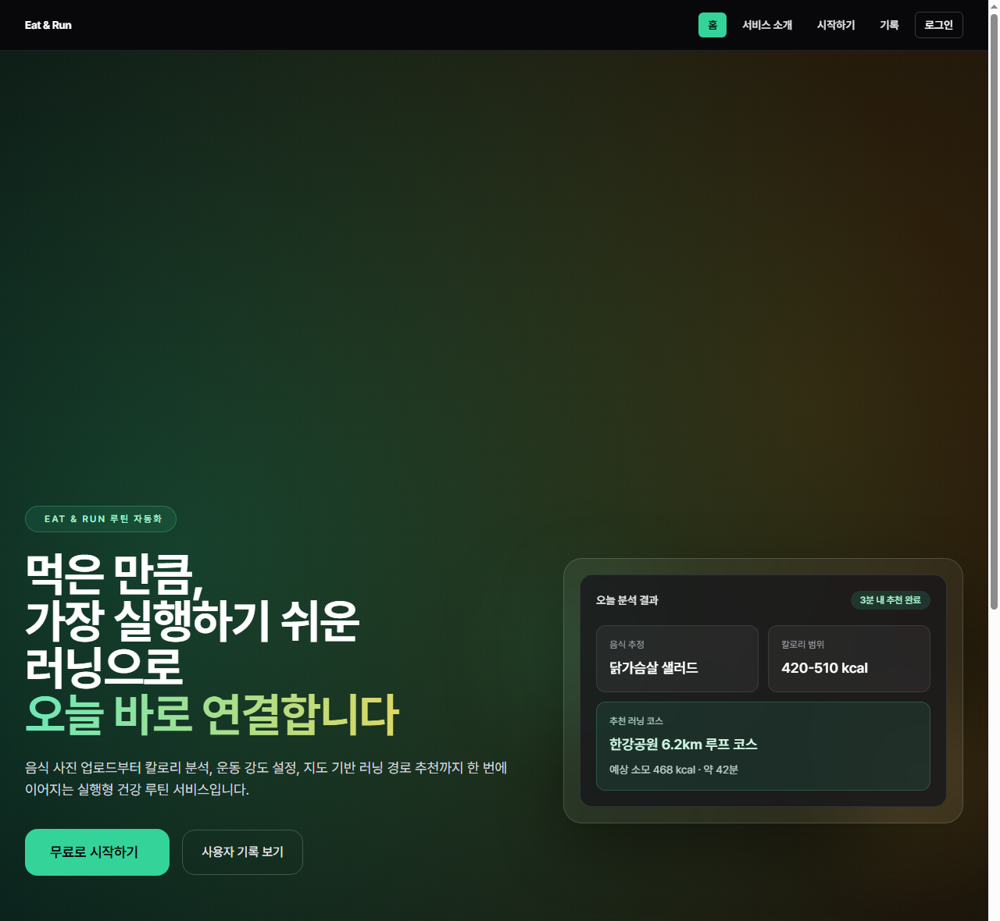
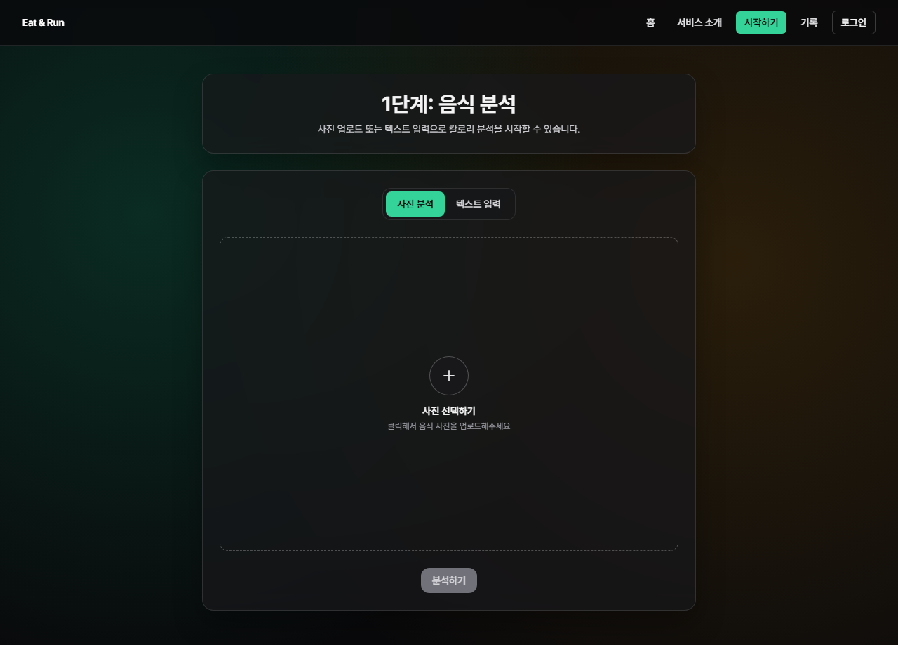
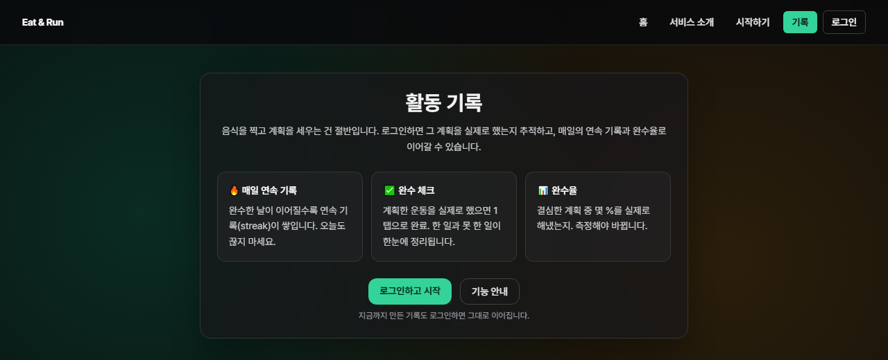

<p align="center">
  
</p>

<h1 align="center">Eat &amp; Run</h1>

<p align="center"><em>Turn what you just ate into an action you actually finish.</em></p>

<p align="center">
  
  
  
  
  
</p>

<p align="center">
  <a href="https://eat-and-run-web.vercel.app"><b>🔗 라이브 데모</b></a>
</p>

---

## 무엇을, 왜

칼로리 앱은 '측정'에서 멈추고, 러닝 앱은 '음식 맥락'이 없습니다. 그 사이의 빈틈 —
**"방금 먹은 것 → 지금 당장의 구체적 행동 → 실제 완수"** 를 잇는 것이 이 제품의 가치(**다리, Bridge**)입니다.

그래서 이 서비스의 성공 지표는 *'기록을 남겼는가'가 아니라* **완수율(계획 → 실제 완수 전환율)** 입니다. 이 지표가 이후 설계 결정의 기준이 됩니다.

## 주요 화면

**랜딩 — "먹은 만큼, 오늘 바로 연결"**



**음식 분석 (입구)**



**게스트 전환 — 완수 루프 가치(연속 기록·완수 체크·완수율)로 로그인 유도**



> 로그인 후 완수 루프 화면(완수 토글 · 오늘의 미완료 직면 · 연속 기록 · 완수율 카드)은 [라이브 데모](https://eat-and-run-web.vercel.app)에서 확인할 수 있습니다.

## 핵심 기능

**입구 — 분석에서 계획까지**
- 음식 사진 업로드 / 텍스트 입력 기반 칼로리 분석 (OpenAI)
- 체중·페이스·소모 비율에 따라 운동 방식(걷기/빠른걸음/달리기)·시간 실시간 계산
- 지도 기반 러닝 경로 추천 (Google Maps, 2개 경로 선택)

**완수 루프 — 계획에서 완수까지**
- 1탭 **완수 체크** (Supabase `history_entries.completed_at`)
- 당일 미완수는 **'놓침(Missed)'** 으로 자동 마감 (잔소리 없이)
- 재방문 시 **'오늘의 미완료' 직면** + **연속 기록(Streak)**
- **완수율 지표** 카드 — 완수 ÷ (완수 + 놓침)

**플랫폼 / 재참여**
- **PWA 설치형 셸** — 홈 화면 설치, 설치 안내 배너
- 익명 쿠키(`eat_run_uid`) 기반 입구 → 로그인 시 기록 계정 이관(migrate)

## 핵심 의사결정

| 결정 | 근거 |
|---|---|
| 완수 판정을 **GPS 자동 → 수동 1탭 먼저** | 웹은 백그라운드 위치 추적 불가 → 검증 안 된 가설에 비싼 기능을 먼저 걸지 않음 |
| 재참여를 **푸시 → 인앱 직면 + Streak** | 웹·익명 환경에서 푸시는 신뢰 불가(iOS 제약 등) |
| 정체성을 **로그인 강제 → 익명 우선 + 전환 훅** | 분석은 비용(OpenAI)이라 루프는 로그인 기능, 익명은 전환 훅 |
| PWA를 **설치형 셸까지만**(푸시·오프라인 제외) | 완수 루프 검증이 먼저 — 비싼 카드에 베팅 보류 |

> 결정 근거 전문은 [`docs/adr/`](./docs/adr/) 참고. 포트폴리오 정리본은 [`docs/portfolio/eat-and-run.md`](./docs/portfolio/eat-and-run.md).

## 아키텍처

```
Browser (PWA)
   │
   ├─ Frontend  ── Next.js App Router (/src)
   │                 ├─ /analyze · /activity · /map · /history · /login
   │                 ├─ /api/v1/*  (history CRUD/PATCH · 분석 프록시 · 경로추천)
   │                 └─ 완수 로직: src/lib/completion.ts (순수 함수 + Vitest)
   │
   ├─ Backend   ── Express (/backend)  ── OpenAI (음식 분석)
   │
   └─ Supabase  ── Auth + history_entries (RLS)
```

- **프론트엔드:** Next.js · TypeScript · TailwindCSS · Zustand · TanStack Query
- **백엔드:** Express (음식 분석 프록시)
- **데이터/인증:** Supabase
- **테스트:** Vitest (완수·놓침·연속기록 판정 단위 테스트)
- **배포:** Vercel(프론트) · Render(백엔드)

## 로컬 실행

### 의존성 설치
```bash
npm install
npm --prefix backend install
```

### 환경 변수

**프론트 `.env.local`**
```env
# Supabase (클라이언트 인증)
NEXT_PUBLIC_SUPABASE_URL=
NEXT_PUBLIC_SUPABASE_ANON_KEY=
# Supabase (서버 라우트 — 기록 읽기/쓰기)
SUPABASE_SERVICE_ROLE_KEY=
# (선택) SUPABASE_URL 미설정 시 NEXT_PUBLIC_SUPABASE_URL로 폴백
SUPABASE_URL=

# 분석 백엔드 연동
ANALYZE_API_URL=http://localhost:4000/v1/food/analyze
BACKEND_API_KEY=

# 지도
NEXT_PUBLIC_GOOGLE_MAPS_API_KEY=
```

**백엔드 `backend/.env`**
```env
OPENAI_API_KEY=YOUR_REAL_OPENAI_KEY
BACKEND_API_KEY=
ANALYZE_RATE_LIMIT_PER_MINUTE=5
TEXT_ANALYZE_RATE_LIMIT_PER_MINUTE=10
ANALYZE_IP_RATE_LIMIT_PER_MINUTE=20
TEXT_ANALYZE_IP_RATE_LIMIT_PER_MINUTE=40
ANALYZE_RATE_LIMIT_WINDOW_MS=60000
GOOGLE_MAPS_API_KEY=
SUPABASE_URL=
SUPABASE_SERVICE_ROLE_KEY=
```

- `BACKEND_API_KEY`를 백엔드에서 쓰면 프론트 `.env.local`에도 같은 값을 넣습니다.
- Supabase 스키마는 [`supabase/schema.sql`](./supabase/schema.sql)을 SQL Editor에서 실행해 생성합니다. (완수 기능을 위해 `history_entries.completed_at` 컬럼이 포함됩니다 — 기존 DB라면 다시 실행해 반영하세요.)

### 실행 / 빌드 / 테스트
```bash
npm run backend:start   # 백엔드(Express)
npm run dev             # 프론트(Next.js)
npm run build           # 프로덕션 빌드
npm start               # 프로덕션 서버 (PWA 서비스워커는 이 모드에서 동작)
npm test                # 단위 테스트 (Vitest)
npm run lint            # 린트
```

## 배포

- **Vercel**(프론트) 배포 체크리스트: [`docs/DEPLOY_VERCEL.md`](./docs/DEPLOY_VERCEL.md)
- **Render**(백엔드) 무료 플랜 keep-alive: GitHub Actions `.github/workflows/render-keep-alive.yml`이 10분마다 `/health`를 호출해 유휴 슬립 방지.
- 필요한 GitHub Actions 시크릿: `RENDER_HEALTHCHECK_URL=https://eatandrunweb.onrender.com/health`

## 문서

- [`docs/adr/`](./docs/adr/) — 설계 결정 기록(왜 그렇게 판단했는가)
- [`docs/portfolio/eat-and-run.md`](./docs/portfolio/eat-and-run.md) — 포트폴리오 정리본
- [`CONTEXT.md`](./CONTEXT.md) — 도메인 용어집(다리 · 계획 · 완수 · 놓침 · 연속기록 · 완수율)
